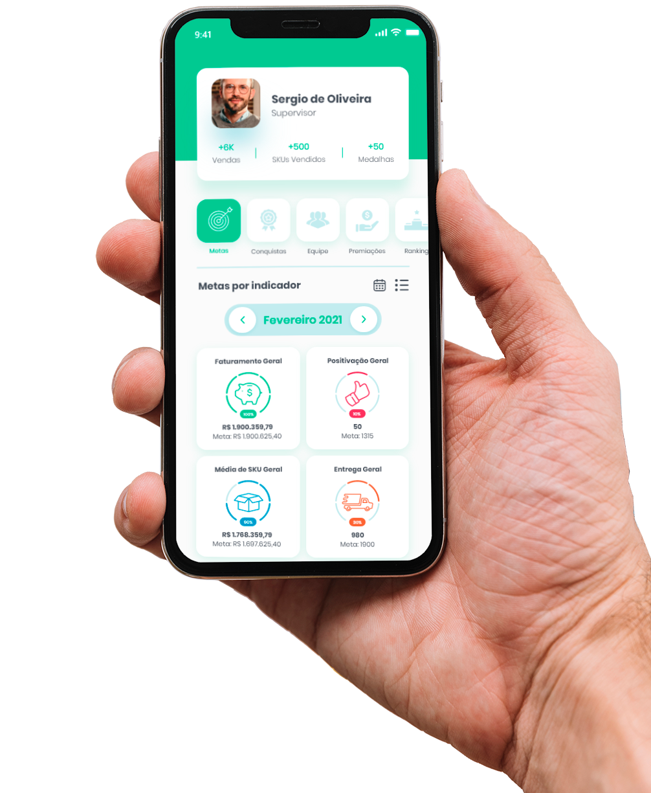

# Controle_venda_VCR
 APP gerenciar vendas
<!---Esses são exemplos. Veja https://shields.io para outras pessoas ou para personalizar este conjunto de escudos. Você pode querer incluir dependências, status do projeto e informações de licença aqui--->



> Uma aplicação web de controle de venda desenvolvida durante o curso de Python no Senac de America em paralelo as aulas para melhorar e aumentar meu conhecimento. O APP vai receber e armazenar as vendas. testando

### Lista de tarefas
Segue a lista de tarefas a serem desenvolvidas no projeto:
- [X] Pré-requisitos
    - [X] Instalar o Python
    - [X] Instalar Visual Studio Code
- [X] Pré-requisitos
    - [X] Instalar o Python
    - [X] Instalar Visual Studio Code
- [X] Criar e ativar o ambiente virtual
```
    python -m venv .\venv\
    venv\Scripts\activate 
```
- [] Inatalar Django
- [] Criar o projeto Controle_Venda_vcr
- [] Subir o servidor e testar o projeto
- [] Alterar o idioma do projeto `pt-br`
- [] Alterear timexone do projeto para `America/Sao_Paulo`
- [] Criar o APP Contro_de_Vendas
- [] Registrar o APP
- [] Configurar rota Inicial (index)
- [] Criar a view para a rota inicial 
- [] Cria o  arquivo index.html
## 📝 Licença
Esse projeto está sob licença. Veja o arquivo [LICENÇA](LICENSE.md) para mais detalhes.
[⬆ Voltar ao topo](#nome-do-projeto)<br>